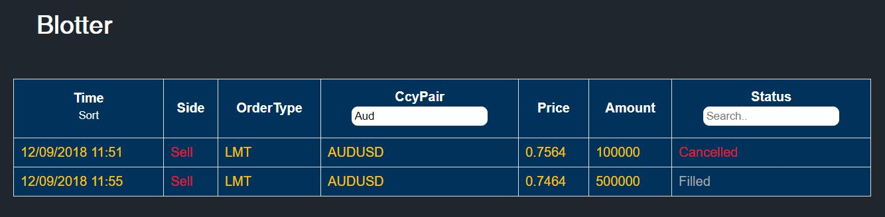
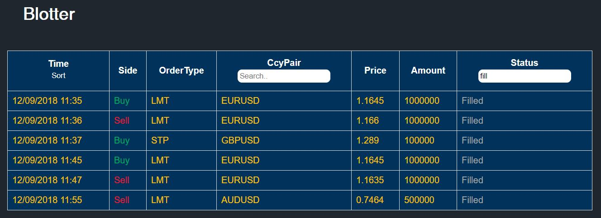
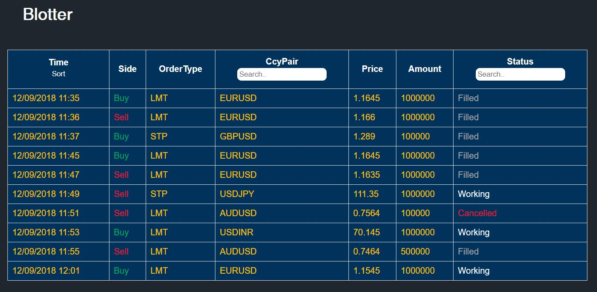
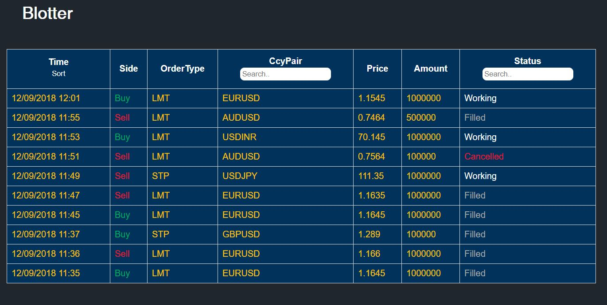

# Intention of this project

The folks at [CoderIq](https://coderiq.io) had an interesting problem statement that they wanted me to attempt.
The following data below is the problem statement of the same.

The time limit to solve the problem was 5 hours and should be considered while going through the code.

The code has not been revisited since the test's completion to maintain the rawness of it.

If you have any feedback over this, please feel free to reach out to me on [LinkedIn](https://www.linkedin.com/in/toshsharma/).

# React Blotter

A blotter is a record of trades and the details of the trades made over a period of time (usually one trading day).

The details of a trade will include such things as the time, price, order size, and a specification of whether it was a buy or sell order.

## Problem Statement

You are given two REST APIs which have: 

* the list of columns : `https://restsimulator.intuhire.com/blotter_columns`

* the orders (rows) : `https://restsimulator.intuhire.com/orders`

Your task is to print: 

1. The blotter table with the columns and rows fetched from the REST APIs.
    * The table should be in blue `#01325B`;
    * The text in the cells of the table should be in amber `#FFC200`.
    * A `BUY` order should be in green `#00A95D` and a `SELL` order should be in red `#E7152D`.
    * For the `Status`, follow these color codes:
        * `Filled` : Grey `#A9A9A9`
        * `Cancelled` : Red `#E7152D`
        * `Working` : White `#FFF`

2. Add one search box in the `CcyPair` column and the `Status` column. When the user starts typing inside the search box, only the matching rows should be displayed. 

3. Add a `Sort` button in the `Time` column. On clicking the button, the table should be sorted in ascending and on clicking it again, it should be sorted in descending.

## Difficulty

Intermediate

## Framework

React

## Run

`yarn start` 

Navigate to port 3000. 

## Screenshots

### Blotter Table

### Search CcyPair

### Search Status

### Sort Ascending

### Sort Descending

